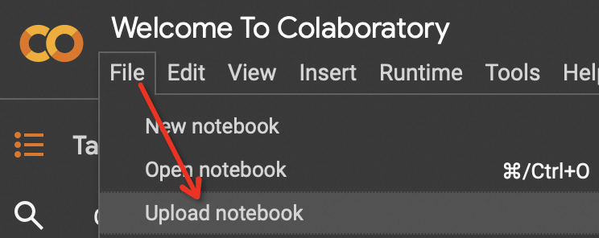
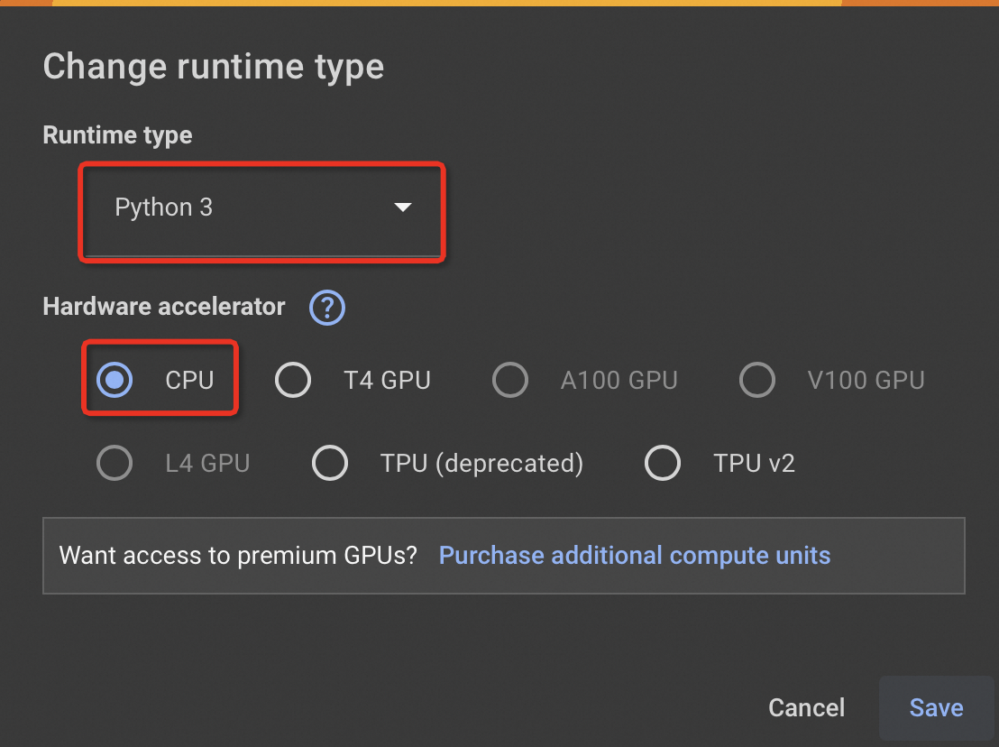

# CSIT5970 Assignment-3 (8 marks)

### Deadline: April 27, 23:59 (Friday)
---

In this assignment, you will write two Spark applications: word count (`word_count.ipynb`) and server log analysis (`log_analysis.ipynb`). This assignment repo consists of the following three notebooks:

* `warmup_notebook.ipynb`: Warmup and environment testing (no grading)
* `word_count.ipynb`: WordCount application (**4 marks**)
* `log_analysis.ipynb`: Apache log analysis (**4 marks**)

**Note:** Make sure you have completed the self-paced Spark tutorial.

The following instructions assume that you have successfully uploaded the notebook to [Colab](https://colab.research.google.com). Make sure you have selected the correct runtime environment (Python 3, CPU) before you start coding. Refer to the following screenshots.

## Warmup and Environment Testing (**no grading**)

We strongly recommend you test your environment before getting started. Import and open `warmup_notebook.ipynb` in your web browser and follow the instructions there.

## Task-1: Word Count Application (**4 marks**)

Open the notebook file (`word_count.ipynb`) in your web browser and follow the instructions carefully. Once you've done coding, you'll submit your Python code `word_count.py` to GitHub for autograding.

### Grading

* **Autograding (5 marks)**: You need to download the assignment code from your Colab workspace. In the notebook web UI, you can click on "File", then hovering your mouse over "Download", and then clicking on "Download .py". This will export your notebook as a `word_count.py` file to your computer. You can `git add` this file, then commit and push it to GitHub to submit your code.

## Task-2: Apache Web Server Log Analysis (**4 marks**)

Open the notebook file (`log_analysis.ipynb`) in your web browser and follow the instructions carefully. Once you're done coding, you should submit your python code `log_analysis.py` for autograding.

### Grading

The grading scheme is exactly the same as that of Task-1: **4 marks** for autograding.

**WARNING**: Failing to submit the converted Python code (e.g., using an inconsistent filename or not exporting the Python file) will result in a deduction of up to **2 marks**.
